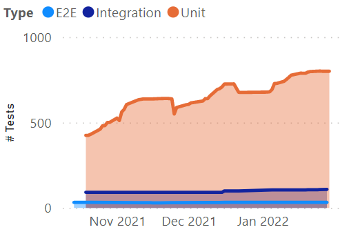

# test-count

```text
NAME
    C:\sources\roel4ez\test-count\test-count.ps1
    
SYNOPSIS
    Count number of tests per type in a git repository
    
    
SYNTAX
    C:\sources\roel4ez\test-count\test-count.ps1 [-GitRepoPath] <String> [-E2ePath <String>] [-IntegrationPath <String>] [-UnitPath <String>] [-FileExtensionWildcard <String>] [-TestAttributeRegex <String>] 
    [-OutputFile <String>] [<CommonParameters>]
    
    
DESCRIPTION
    Simple PowerShell script that outputs a csv file of the number of tests, per
    type and per commit. This data can then be used to generate a simple chart.
    

PARAMETERS
    -GitRepoPath <String>
        Path to the repository of which tests should be counted

    -E2ePath <String>
        Relative path to the directory containing E2E tests (default = Tests/E2E)

    -IntegrationPath <String>
        Relative path to the directory containing Integration tests (default = Tests/Integration)

    -UnitPath <String>
        Relative path to the directory containing Unit tests  (default = Tests/Unit)
        
    -FileExtensionWildcard <String>
        File extension of the files containing tests  (default = *.cs)

    -TestAttributeRegex <String>
        Regex of attributes that define tests in your setup  (default = \[ *(Fact|Theory) *\])
        
    -OutputFile <String>
        Name of the output file, will be stored in current directory (default = test-count.csv)

    <CommonParameters>
        This cmdlet supports the common parameters: Verbose, Debug,
        ErrorAction, ErrorVariable, WarningAction, WarningVariable,
        OutBuffer, PipelineVariable, and OutVariable. For more information, see
        about_CommonParameters (https://go.microsoft.com/fwlink/?LinkID=113216). 

REMARKS
    To see the examples, type: "Get-Help C:\sources\roel4ez\test-count\test-count.ps1 -Examples"
    For more information, type: "Get-Help C:\sources\roel4ez\test-count\test-count.ps1 -Detailed"
    For technical information, type: "Get-Help C:\sources\roel4ez\test-count\test-count.ps1 -Full"
```

Example of a chart, generated by PowerBI:


